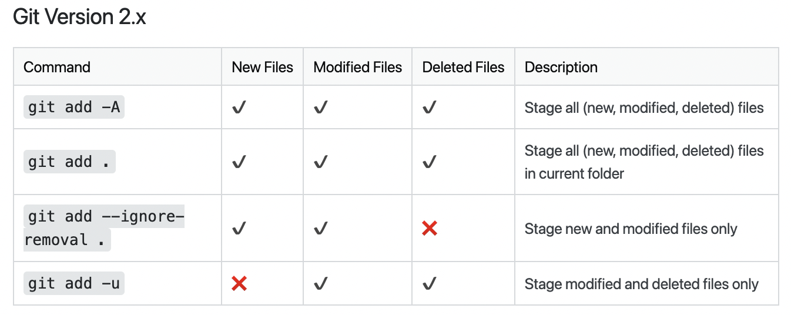

# tag

git tag something

git tag -a v1.0.0 -m "v1.0.0"

git push --tags

git tag -d local_tag_name

git push -d remote_tag_name

# rebase

git rebase -i

i esc :wq

git rebase --continue

# add

# editor

git config --global core.editor "code --wait"
